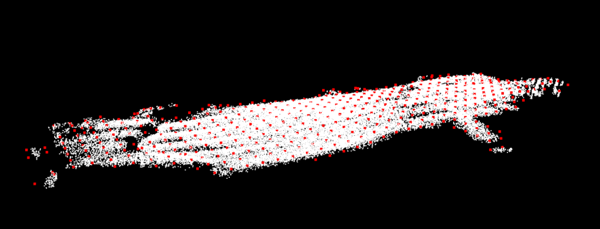

# bspline_surface
A repo. which used to generate 3d surface using bspline.



## Depend
- PCL

## Usage
```
git clone https://github.com/zhan994/bspline_surface.git
cd bspline_surface
mkdir build && cd build
cmake ..
make

./bspline_surface <path-to-data>.pcd
```